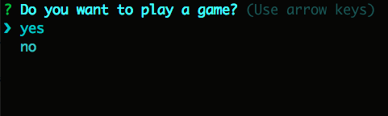
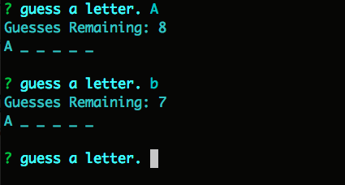
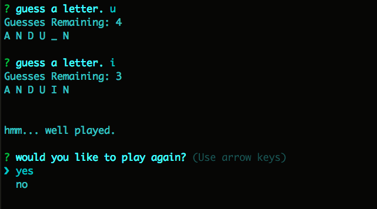
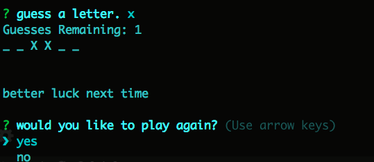

# Hangman-CLI

This command line application allows for a user to play the classic game hangman. 

It uses node.js and the inquirer package.

The application uses javascript constructors broken into modules to create gameplay.

